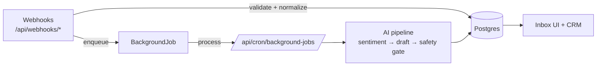

# ZRG Dashboard — Master Inbox + CRM

Multi-tenant sales inbox + CRM that unifies **SMS (GoHighLevel)**, **Email (Inboxxia/EmailBison, SmartLead, Instantly)**, and **LinkedIn (Unipile)** into a single conversation record, with AI-driven sentiment + drafting, follow-up automation, and booking.

**Last reviewed:** 2026-02-17

> Internal repo: never commit secrets or PII. Use `.env.local` and keep exported logs/CSV/XLSX local-only.

## Contents

- [Quickstart](#quickstart)
- [Golden Path (Where To Start)](#golden-path-where-to-start)
- [Architecture](#architecture)
- [Phase Planning (docs/planning)](#phase-planning-docsplanning)
- [Integrations](#integrations)
- [Environment Variables](#environment-variables)
- [Deployment](#deployment)
- [Testing](#testing)
- [Troubleshooting](#troubleshooting)
- [Contributing](#contributing)
- [Related Docs](#related-docs)

## Quickstart

### Prerequisites

- Node.js (latest LTS recommended)
- Access to the Supabase project (Postgres + Auth) used by this app

### Local setup

```bash
npm install
cp .env.example .env.local

# Sync Prisma schema to the database (required after schema changes)
npm run db:push

npm run dev
```

Open `http://localhost:3000`.

## Golden Path (Where To Start)

If you’re new, this order minimizes confusion:

1. `prisma/schema.prisma` — canonical data model (tenancy, leads, messages, automation, jobs)
2. `app/api/webhooks/*` — inbound ingestion (external systems → normalize → dedupe → DB → enqueue)
3. `app/api/cron/*` — automation runners (follow-ups, background jobs, availability, insights)
4. `lib/*` — domain logic (AI drafts, safety gates, follow-up engine, booking)
5. `actions/*` — Server Actions (DB write paths for the UI)
6. `components/dashboard/*` — UI surfaces (inbox, CRM, settings)
7. `docs/planning/*` — phase plans + evidence + reviews (how we ship safely)

## Architecture

### Tech stack

| Layer | What we use |
|------|-------------|
| UI | Next.js App Router, React, Tailwind, shadcn/ui |
| Backend | Next.js API routes + Server Actions |
| Data | Supabase Postgres + Prisma |
| Hosting | Vercel (serverless + cron) |
| AI | OpenAI (sentiment, drafting, safety/evaluators) |
| Jobs | DB-backed BackgroundJob runner + optional Inngest dispatch |

### Core concepts (mental model)

- **Client** = workspace/tenant (integration keys, settings, members)
- **Lead** = a person/contact unified across channels
- **Message** = a single inbound/outbound message with `channel` (`sms` | `email` | `linkedin`)
- **AIDraft / DraftPipelineRun** = AI-generated reply drafts + artifacts/telemetry
- **FollowUpSequence / Step / Instance** = cron-driven automation state machine
- **BackgroundJob** = async work queue (AI post-process, enrichment, etc.)
- **CalendarLink / WorkspaceAvailabilityCache** = availability + booking automation

### High-level flow



### Webhook ingestion + background jobs

Design goal: keep webhook handlers fast and reliable. Webhooks should do the minimum DB work (normalize, dedupe, insert, enqueue) and defer heavy processing (AI calls, enrichment, booking qualification) to background jobs.

Background jobs are processed by `/api/cron/background-jobs` (schedule in `vercel.json`). This route supports:

- **Inline processing** (default): the cron handler processes `BackgroundJob` rows directly
- **Inngest dispatch** (optional): when Inngest is configured, the cron handler publishes dispatch events instead of doing all work inside the cron request

Useful toggles (see `app/api/cron/background-jobs/route.ts`):

- `BACKGROUND_JOBS_USE_INNGEST` — force dispatch mode on/off
- `BACKGROUND_JOBS_FORCE_INLINE` — emergency rollback to inline mode
- `BACKGROUND_JOBS_INLINE_EMERGENCY_FALLBACK` — allow inline fallback when dispatch enqueue fails (keep off unless actively mitigating an incident)
- `BACKGROUND_JOBS_INLINE_ON_STALE_RUN` — when stale `process-background-jobs` runs are auto-recovered, run one inline recovery cycle before dispatching again (defaults to on when unset)
- `BACKGROUND_JOB_WORKER_CONCURRENCY` — bounded worker fan-out inside a single background run (`1-8`, default `4`)
- `BACKGROUND_JOBS_INNGEST_CONCURRENCY` — bounded Inngest function concurrency for `process-background-jobs` (`1-8`, default `2`)
- `BACKGROUND_JOB_WORKSPACE_QUOTA_DEFAULT` — per-workspace concurrent job ceiling baseline (`1-100`, default `64`)
- `BACKGROUND_JOB_WORKSPACE_QUOTA_ENTERPRISE` — high-quota ceiling used only after promotion gates pass (`1-100`, default `100`)
- `BACKGROUND_JOB_ENTERPRISE_CLIENT_IDS` — **deprecated fallback** comma-separated workspace IDs used only during Phase 172 cutover while `WorkspaceSettings.highQuotaEnabled` becomes source-of-truth
- `BACKGROUND_JOB_AUTOSCALE_GLOBAL_FLOOR` — autoscale global floor (default `1024`)
- `BACKGROUND_JOB_AUTOSCALE_WORKSPACE_MULTIPLIER` — workspace multiplier for global target (`target = max(floor, activeWorkspaces * multiplier)`, default `64`)
- `BACKGROUND_JOB_AUTOSCALE_RAMP_STEP` — capacity increase per healthy ramp window (default `64`)
- `BACKGROUND_JOB_AUTOSCALE_RAMP_WINDOW_MINUTES` — healthy ramp interval in minutes (default `5`)
- `BACKGROUND_JOB_AUTOSCALE_STEP_DOWN_FACTOR` — multiplicative step-down factor on guardrail breach (default `0.5`)
- `BACKGROUND_JOB_AUTOSCALE_OVERRIDE_CAPACITY` — operator override to pin autoscale capacity (optional)
- `BACKGROUND_JOB_AUTOSCALE_FORCE_CONTENTION_BREACH` / `BACKGROUND_JOB_AUTOSCALE_FORCE_FAILURE_RATE_BREACH` — force guardrail breach signals for staging validation (optional)
- `BACKGROUND_JOB_PARTITION_PER_WORKSPACE_CAP` — max jobs pulled per workspace into each run’s partitioned selection pool (default mirrors run limit)
- `BACKGROUND_JOB_HIGH_QUOTA_PROMOTION_ENABLED` — enables promotion-gate evaluation for high-quota eligibility
- `BACKGROUND_JOB_HIGH_QUOTA_PROMOTION_REQUIRED_WINDOWS` — healthy windows required before promotion gate opens (default `4`)
- `BACKGROUND_JOB_HIGH_QUOTA_PROMOTION_WINDOW_MINUTES` — duration of each healthy window (default `30`)
- `BACKGROUND_JOB_HIGH_QUOTA_PROMOTION_QUEUE_AGE_P95_MAX_SECONDS` — max queue-age p95 allowed for healthy window (default `180`)
- `BACKGROUND_JOB_HIGH_QUOTA_PROMOTION_FAILURE_RATE_MAX_PERCENT` — max failure-rate percent allowed for healthy window (default `0.5`)
- `BACKGROUND_JOB_HIGH_QUOTA_DEMOTION_REQUIRED_WINDOWS` — sustained breach windows required for demotion (default `2`)
- `BACKGROUND_JOB_HIGH_QUOTA_DEMOTION_WINDOW_MINUTES` — duration of each demotion breach window (default `15`)
- `BACKGROUND_JOB_HIGH_QUOTA_DEMOTION_FAILURE_RATE_MIN_PERCENT` — minimum failure-rate percent that counts toward demotion breach windows (default `2.0`)
- `BACKGROUND_JOB_HIGH_QUOTA_PROMOTION_DUPLICATE_SEND_MAX_COUNT` — max duplicate sends allowed in healthy window (default `0`)
- `BACKGROUND_JOB_OBS_DUPLICATE_SEND_COUNT` — manual duplicate-send override merged with durable `BackgroundFunctionRun.lastError` duplicate-signal scan
- `BACKGROUND_FUNCTION_RUN_STALE_MINUTES` — stale cutoff for `BackgroundFunctionRun` recovery (default `15`)
- `BACKGROUND_FUNCTION_RUN_STALE_RECOVERY_LIMIT` — max stale run rows recovered per cron tick (default `25`)

### Cron-driven automation

Cron schedules live in `vercel.json`. All cron routes require `Authorization: Bearer ${CRON_SECRET}` (legacy `x-cron-secret` is accepted on many routes).

Key cron families:

- **Follow-ups**: `/api/cron/followups` (sequence processing + resumptions + notification digests)
- **Background jobs**: `/api/cron/background-jobs` (dispatch via Inngest or run inline based on env)
- **Availability / booking**: `/api/cron/availability`, `/api/cron/booking-qualification-jobs`, `/api/cron/calendar-health`
- **Insights**: `/api/cron/insights/*` (context packs, booked summaries, message performance)

### Multi-tenancy + auth

- Auth is handled by Supabase (browser sessions).
- `middleware.ts` refreshes/protects UI routes and intentionally bypasses `/api/*` to keep webhook/cron paths hot and avoid unnecessary auth network calls.
- Workspace access checks live in `lib/workspace-access.ts` (owner + `ClientMember` roles).

## Phase Planning (docs/planning)

We track meaningful changes as a numbered “phase” under `docs/planning/phase-<N>/` so onboarding, risk, and rollout are explicit.

What a phase typically contains:

- `docs/planning/phase-<N>/plan.md` — purpose, context, constraints, success criteria, subphase index
- `docs/planning/phase-<N>/<a|b|c|...>/plan.md` — scoped subphase plans (optional)
- `docs/planning/phase-<N>/review.md` — closure doc mapping evidence → success criteria (recommended)
- `docs/planning/phase-<N>/artifacts/` — logs/screenshots/data used as evidence (keep sensitive artifacts local-only)

Tips:

- Use the next available number: `ls -dt docs/planning/phase-* | head`.
- For a recent example (format + evidence style), see `docs/planning/phase-168/plan.md`.
- Prefer evidence over vibes: timestamps, command outputs, links to artifacts.
- Don’t put secrets/PII in planning docs or committed artifacts.
- Close the loop with a `review.md` that maps outcomes to success criteria and records which quality gates you ran.

## Integrations

### Webhooks (external → ZRG)

Most webhooks follow the same shape: **validate → find workspace → normalize → dedupe → insert Message/WebhookEvent → enqueue BackgroundJob → return 2xx**.

- **GHL SMS**: `POST /api/webhooks/ghl/sms` (workspace resolved via `payload.location.id` → `Client.ghlLocationId`)
- **Inboxxia / EmailBison**: `POST /api/webhooks/email` (workspace resolved via `?clientId=` or payload `workspace_id`)
- **SmartLead**: `POST /api/webhooks/smartlead?clientId=...` (auth via Bearer, `x-smartlead-secret`, or payload `secret_key`; expected secret stored in `Client.smartLeadWebhookSecret`)
- **Instantly**: `POST /api/webhooks/instantly?clientId=...` (auth via Bearer or `x-instantly-secret`; expected secret stored in `Client.instantlyWebhookSecret`)
- **LinkedIn (Unipile)**: `POST /api/webhooks/linkedin` (auth via `x-unipile-secret` when `UNIPILE_WEBHOOK_SECRET` is set)
- **Calendly**: `POST /api/webhooks/calendly/[clientId]` (signing key from `Client.calendlyWebhookSigningKey` or `CALENDLY_WEBHOOK_SIGNING_KEY`)
- **Slack interactions**: `POST /api/webhooks/slack/interactions`
- **Clay**: `POST /api/webhooks/clay`

### Admin automation

- **Workspace provisioning**: `POST /api/admin/workspaces` (auth: `Authorization: Bearer ${WORKSPACE_PROVISIONING_SECRET}`)
- **Workspace bootstrap**: `POST /api/admin/workspaces/bootstrap` (same auth)
- **Member bootstrap**: `POST /api/admin/workspaces/members` (same auth)

For request/response payloads, see the corresponding route files under `app/api/admin/*`.

## Environment Variables

Start with `.env.example` (checked in). Real values belong in `.env.local` (gitignored) or Vercel Environment Variables.

### Required (local dev)

| Variable | Purpose |
|----------|---------|
| `NEXT_PUBLIC_APP_URL` | Base URL used for absolute links/callbacks |
| `NEXT_PUBLIC_SUPABASE_URL` | Supabase project URL |
| `NEXT_PUBLIC_SUPABASE_ANON_KEY` | Supabase anon key (browser auth) |
| `SUPABASE_SERVICE_ROLE_KEY` | Server-side Supabase access (webhooks/admin jobs) |
| `DATABASE_URL` | Pooled Postgres connection (runtime) |
| `DIRECT_URL` | Direct Postgres connection (Prisma CLI) |

### Common (feature-dependent)

| Variable | Purpose |
|----------|---------|
| `OPENAI_API_KEY` | AI sentiment/drafting/evaluators |
| `CRON_SECRET` | Auth for `/api/cron/*` routes |
| `WORKSPACE_PROVISIONING_SECRET` | Auth for `/api/admin/*` provisioning routes |
| `INNGEST_EVENT_KEY`, `INNGEST_SIGNING_KEY` | Enable Inngest-backed background dispatch |
| `UPSTASH_REDIS_REST_URL`, `UPSTASH_REDIS_REST_TOKEN` | Redis-backed caching/queues where used |
| `UNIPILE_DSN`, `UNIPILE_API_KEY`, `UNIPILE_WEBHOOK_SECRET` | LinkedIn integration (send + inbound webhook auth) |

For advanced AI tuning knobs and reliability controls, see `CLAUDE.md`.

## Deployment

- **Hosting**: Vercel
- **Cron**: defined in `vercel.json` (Vercel invokes routes with `Authorization: Bearer ${CRON_SECRET}`)
- **Database**: Supabase Postgres (set both `DATABASE_URL` and `DIRECT_URL`)

Recommended workflow:

```bash
vercel link
vercel env pull .env.local
```

## Testing

```bash
npm run lint
npm run typecheck
npm run build

npm test
npm run test:ai-drafts
npm run test:ai-replay -- --client-id <clientId> --dry-run
npm run test:e2e
```

## Troubleshooting

- **Cron 401**: verify `CRON_SECRET` and the `Authorization: Bearer ...` header.
- **Prisma schema mismatch errors**: run `npm run db:push` against the correct database.
- **Webhook “provider mismatch”** (SmartLead/Instantly): confirm `Client.emailProvider` matches the configured webhook.
- **Inngest not triggering**: confirm `INNGEST_EVENT_KEY`/`INNGEST_SIGNING_KEY` are set and `/api/inngest` is reachable in the deployed environment.

## Contributing

- Prefer working from a phase plan: `docs/planning/phase-<N>/plan.md`.
- Keep Server Actions small and return `{ success, data?, error? }`.
- Treat all webhooks as untrusted input; validate + sanitize before writes.
- If you modify `prisma/schema.prisma`, you must run `npm run db:push`.

## Related Docs

- `AGENTS.md` — repo conventions + workflows
- `CLAUDE.md` — AI/dev quick reference + architecture notes
- `End2End.md` — strict, source-grounded end-to-end guide
- `Follow-Up Sequencing.md` — follow-up system notes
- `docs/notes/booking-process-5.md` — booking process deep dive
